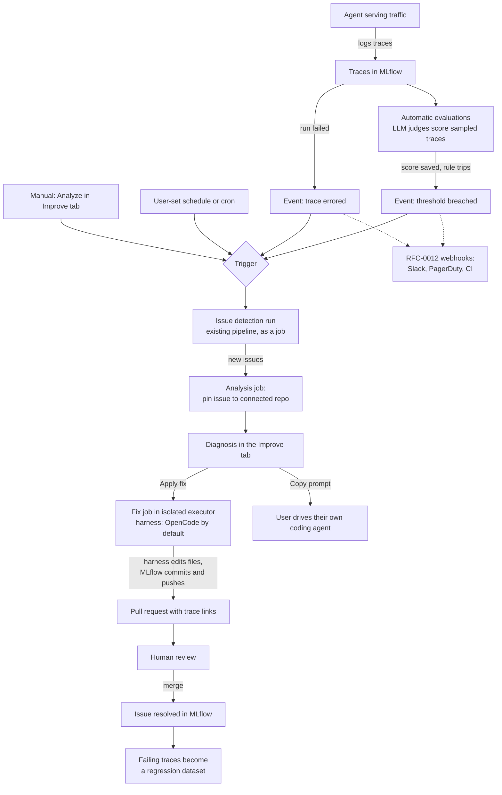

# RFC 0013: Agent Improvement Workflow

| start_date   | 2026-07-28 |
| :----------- | :--------- |
| mlflow_issue | |
| rfc_pr       | |

| Author(s)              | [Nehanth Narendrula](https://github.com/Nehanth) (Red Hat) |
| :--------------------- | :-- |
| **Date Last Modified** | 2026-08-25 |
| **AI Assistant(s)**    | Claude Code |

**Table of contents**

- [Summary](#summary)
- [Basic example](#basic-example)
- [Motivation](#motivation)
  - [The problem](#the-problem)
  - [User journeys](#user-journeys)
  - [Out of scope](#out-of-scope)
- [High-level design](#high-level-design)
- [Detailed design](#detailed-design)
- [Drawbacks](#drawbacks)
- [Alternatives](#alternatives)
- [Adoption strategy](#adoption-strategy)
- [Open questions](#open-questions)
- [Appendix: the loop in one diagram](#appendix-the-loop-in-one-diagram)

# Summary

RFC-0012 (Trace-Aware Webhook Events) gives MLflow the ability to send a signal when an agent degrades. This RFC proposes what acts on that signal: an **Improve** tab in the experiment UI where the user connects the agent's repository, reads a diagnosis of what went wrong and where in the code it points, and approves a fix that arrives as a pull request.

The fix is written by a coding agent, not by MLflow itself. MLflow bundles [OpenCode](https://github.com/sst/opencode), an MIT-licensed open-source coding agent, as the default harness so the workflow works out of the box — and the harness is pluggable, so teams that already use Claude Code, Codex, or their own tooling can point the workflow at that instead. Inference always runs on the user's own model access, through an AI Gateway endpoint or their provider keys. MLflow never runs managed inference for fixes, and nothing merges without a human review.

The building blocks are things MLflow has today or will have once its in-flight proposals land: [automatic issue detection](https://mlflow.org/docs/latest/genai/eval-monitor/ai-insights/detect-issues/) produces the findings, RFC-0012's events provide the trigger, the job executor framework ([RFC-0002](https://github.com/mlflow/rfcs/blob/main/rfcs/0002-job-executor-plugins/0002-job-executor-plugins.md)) provides the execution model, the prompt registry and `optimize_prompts()` cover prompt fixes, and evaluation datasets turn fixed failures into regression tests.

# Basic example

```python
import mlflow

# One-time setup: connect the agent's repository to the experiment
mlflow.genai.connect_repo(
    experiment_id="12345",
    repo_url="https://github.com/acme/support-agent",
    token_secret="github-pat",   # stored via MLflow secret handling
)

# Suggestions come from automatic issue detection, which the workflow
# runs when RFC-0012's events fire; list the open ones and apply one
suggestions = mlflow.genai.list_improvements(experiment_id="12345", status="open")
job = mlflow.genai.apply_improvement(
    suggestion_id=suggestions[0].id,
    harness="opencode",          # the bundled default; any configured harness works
)
print(job.pr_url)                # pull request opened by the coding agent
```

# Motivation

## The problem

When MLflow detects a problem today, the user is on their own for everything that follows. Issue detection can report "tool call failures in `search_documents`, 14 traces affected, severity high" — and then the user must find the cause in their code, write the fix, remember to test against the traces that failed, and hope the same regression does not return silently. Every step is manual, and none of the context MLflow holds (the traces, the issue, the root-cause summary) travels with the user into their editor.

The industry is converging on closing this loop. [LangSmith Engine](https://docs.langchain.com/langsmith/engine) diagnoses issues against connected source code and proposes fixes as pull requests, but it is closed source, runs only on LangChain-managed inference, and is metered per scan. Other competitors ship "self-healing" loops that feed the customer's own coding agent over MCP. No open-source platform ships this end to end. MLflow has nearly every piece already and can be first.

## User journeys

### From failing traces to a reviewed fix

A team runs a support agent traced to MLflow. A provider deprecates the model identifier the agent has hardcoded, and every request starts failing.

1. In the experiment's **Improve** tab, the team has already connected their repository: URL and an access token, stored through MLflow's existing secret handling, plus the harness choice. This is one-time setup. The connection lives at the experiment level, since an experiment usually tracks a single agent — a team running several agents connects each experiment to its own repository.

2. The `trace.errored` events (RFC-0012) trigger the workflow. It runs automatic issue detection scoped to the failing traces — detection today is started from a button in the UI, but the button just calls a server endpoint that runs detection as a job, so the workflow invokes the same run programmatically. Because detection costs judge inference, automatic runs are scoped to the triggering traces and rate-limited.

3. The finding is matched against the connected code, and a diagnosis appears in the queue:

   ```
   [HIGH] Model identifier 'gpt-4o-mini' is deprecated
   All requests failing since 02:14 UTC — 20 consecutive traces, same error.
   Points at: agent/config.py
   ```

   Nothing has touched the repository at this point beyond a read. No agent has run and no branch exists.

4. The user reviews the diagnosis and chooses:
   - **Apply fix:** the coding agent receives the diagnosis and the failing traces, changes the identifier, and opens a pull request whose description links every affected trace so the reviewer can verify the evidence without leaving GitHub.
   - **Copy prompt:** a ready-made prompt containing the diagnosis and evidence, for teams that prefer to paste it into whatever coding agent they already drive themselves.

5. The pull request goes through the team's normal review. Merging is entirely the human's decision.

6. On merge, the issue is resolved in MLflow, and the traces that exposed the failure are added to an evaluation dataset ([`merge_records()`](https://mlflow.org/docs/latest/genai/datasets/) accepts traces directly) — the failure is now a regression test. A pull request closed without merging means the reviewer rejected the change: the diagnosis is marked **rejected**, and later detection runs do not re-propose the same fix.

   MLflow learns the outcome by polling the pull request through the submission backend, with backoff — checks start frequent and stretch out as the PR ages. After a bounded window, MLflow stops polling altogether and marks the diagnosis **stale**; opening it in the tab re-checks once, on demand. A PR that humans ignore therefore costs nothing in the background. Whether the forge should instead push events to MLflow is left to the detailed design: that would be a new inbound endpoint on the MLflow server (RFC-0012's webhooks only send outbound), which is a larger security decision than polling.

   **UI path:** Improve tab → queue sorted by severity → expand a diagnosis for trace links and actions → history view links each past diagnosis to its pull request and shows whether it merged, was rejected, or went stale.

The same journey covers any failure with a consistent error signature: a renamed tool, a dead endpoint in an MCP server's configuration, a dependency that changed its API.

### Fix a stale prompt without touching code

A support agent's system prompt was written before the product's new billing system launched. Users now ask billing questions the prompt gives no guidance on, and the agent answers vaguely. Nothing errors — but the relevance and completeness scores on those conversations drop, because the judge can see from the conversation alone that the answers are not addressing what users asked.

1. The threshold event fires on the rolling average and triggers the workflow. The diagnosis points at the prompt rather than the code, with the low-scoring conversations as evidence.
2. Because MLflow already has a prompt registry and [prompt optimization](https://mlflow.org/docs/latest/genai/prompt-registry/optimize-prompts/), the fix path needs no coding agent: the low-scoring traces become the evaluation set, `optimize_prompts()` rewrites the prompt against them, and the improved version is registered with before-and-after scores shown in the diagnosis.
3. If the agent loads its prompt from the registry, shipping the fix is an alias update — and rollback is the same pointer moved back. If the prompt lives in the source tree, the new version goes through a pull request like any code fix.

The same shortcut extends beyond prompts as the registries land: a skill is, like a prompt, mostly instructions as text, so a diagnosis rooted in a skill's instructions can become a new skill version registered through the Skill Registry and rolled out or back through the registry's own versioning. The coding harness is reserved for what actually is code.

### Keep detection running on a schedule

A team wants findings to accumulate even when no alert fires.

1. In the Improve tab, set a detection schedule — an interval or cron expression fitting their traffic (hourly, nightly).
2. Detection runs periodically over the traces that arrived since the last run, and new findings appear in the queue with no one pressing a button. Scheduled runs execute through the same job framework as everything else.

### Fix the component, not just the repo (future)

A production agent is really several components: its own code, the MCP servers it calls, the skills it loads. As MLflow's registry work lands — the [MCP Registry (RFC-0004)](https://github.com/mlflow/rfcs/blob/main/rfcs/0004-mcp-registry/0004-mcp-registry.md), the [Skill Registry (RFC-0008)](https://github.com/mlflow/rfcs/blob/main/rfcs/0008-mvp-skill-registry/0008-mvp-skill-registry.md), and the [Agent Registry (PR #39)](https://github.com/mlflow/rfcs/pull/39) — MLflow will know an agent's composition and where each component's source lives. A diagnosis can then name the component, and fixes become registry updates, not just pull requests: a failing tool call produces a fix against that MCP server's source and an updated registry definition; a broken skill produces a new registered version, propagated to every agent that uses it with the registry's review and rollback semantics. The workflow starts with one connected repository and gains this precision as each registry ships.

Some agents have no fixable repository of their own at all: a closed-source, proprietary harness (Claude Code, for example) plus a set of skills and MCP configurations. That is a supported configuration — the harness itself is not fixable, so diagnoses target the components, and the fixes land in the skills and MCP servers rather than in agent code. An agent whose "repository" is just its components plus a reference to the harness works the same way.

## Out of scope

- **Auto-merging.** Every fix ends as a pull request that a human reviews.
- **Managed inference.** MLflow never proxies detection or fix generation through its own model access.
- **CI/CD beyond the pull request:** deployment, rollback, and release management stay with the team's existing tooling.
- **New detection capabilities.** This RFC consumes issue detection and the RFC-0012 events; it does not extend them.
- **Responding to PR review comments.** Once the pull request is open, iterating on it belongs to the team and their existing tools — a reviewer can drive GitHub Copilot or their own coding agent on the PR. MLflow's involvement ends at proposing the fix and tracking the outcome.

# High-level design

## Three interfaces

The fix pipeline is three phases, each behind its own pluggable interface. The journey above shows the default combination — GitHub for the source, OpenCode for the fix, a GitHub pull request for review — but that is one backend combination, not the architecture. Other combinations work the same way: GitLab for the source, Claude Code for the fix, a merge request for review, etc.

**1. Acquire editable source.** How MLflow obtains a writable checkout of the agent's code from the system of record. Backends: GitHub (default), GitLab, any plain git remote, or a local directory; systems like SVN can be added without touching the rest of the pipeline. The credentials for reaching the code live in this phase and nowhere else.

**2. Apply a fix.** How a diagnosis becomes file changes in that checkout. Backends: OpenCode (the bundled, MIT-licensed default), Claude Code, other coding agents, or a plain script for mechanical fixes with no model calls at all. The backend is invoked in the workspace with the diagnosis and trace evidence as input, edits files, and exits. The only secret this phase ever sees is its own model access (an AI Gateway endpoint) — the interfaces on either side hold the repository credentials, so a coding agent structurally cannot touch them.

**3. Submit for human review.** How the changed code reaches people. Backends: a GitHub pull request (default), a GitLab merge request, a patch bundle, a pushed branch for teams with their own review tooling, or delegating to a forge's own coding agent (for example, filing a GitHub issue assigned to Copilot). **Copy prompt** is the simplest backend of all: no checkout and no branch — MLflow hands the user the diagnosis and evidence as a ready-made prompt for whatever coding agent they drive themselves, skipping phases 1 and 2 entirely.

## Everything runs on the job framework

Scheduled detection, the analysis that pins issues to code, and the fix jobs are all jobs under RFC-0002, inheriting its routing, lifecycle tracking, retries, and recovery. Whether a job runs inside the server process or, once the [Docker and Kubernetes executors](https://github.com/mlflow/rfcs/pull/3) land, in its own container, is an executor decision — and isolation matters most for phase 2, since it executes model-directed changes against a repository checkout. Until remote executors are available, server-side fix execution stays opt-in, and the Copy-prompt backend covers teams who want the loop today.

**Scheduled detection uses the same machinery as automatic evaluations.** The MLflow server already runs one periodic background job today: the scoring job behind automatic evaluations, which wakes on an interval, picks up traces that arrived since its last checkpoint, scores a sample, and records where it stopped. [RFC-0002](https://github.com/mlflow/rfcs/blob/main/rfcs/0002-job-executor-plugins/0002-job-executor-plugins.md) formalizes exactly that machinery — periodic jobs, one scheduler leader deciding when they fire, workers in each server replica executing them. Once that framework's implementation lands in MLflow, scheduled detection registers one more periodic job with it instead of building any scheduler of its own:

1. The schedule — an interval or cron expression — is saved with the experiment's Improve configuration.
2. When it fires, the job invokes the same detection run the UI button starts, scoped to traces that arrived after the previous run's checkpoint.
3. The run records a new checkpoint (the last trace timestamp it processed), so consecutive runs never re-analyze the same traces.
4. Because every detection run spends judge inference, the per-experiment rate limits and cost bounds described earlier apply to each firing.

## What MLflow stores

None of this state exists today. The proposal adds four new pieces of stored state; everything else the workflow produces lands in storage MLflow already has — improved prompts in the prompt registry, regression traces in evaluation datasets, credentials in the existing secrets store, job records in the job framework's own tables. The threshold rules and their cooldown state belong to RFC-0012 and are stored there.

1. **The Improve configuration**, one per experiment: the source location, the backend chosen for each of the three interfaces, credential references into the existing secrets store for the acquisition and submission backends (never the tokens themselves), the trigger settings — which RFC-0012 events start an analysis for this experiment — and the optional detection schedule.
2. **Diagnoses**: the experiment and the issue each one came from, severity, title and summary, the target (code or prompt) and what it points at (file path or prompt URI), the linked trace ids, and a status — open, applied, rejected, stale, or dismissed. For prompt targets, the before-and-after evaluation scores from the optimization run. Rejected diagnoses are kept, which is what lets later detection runs avoid re-proposing a rejected fix.
3. **Fix runs**, one per applied diagnosis: the job that ran it, the backends used, where the result was submitted (pull request URL, branch, or patch reference), the outcome, the harness's error output when a run fails, the evaluation dataset the failing traces were merged into, and the polling bookkeeping — last checked and next check — behind the backoff schedule.
4. **Detection bookkeeping**, one row per experiment: the checkpoint (last-processed trace timestamp) so runs never re-analyze the same traces, and the last-run time that enforces the per-experiment rate limit. This piggybacks on the same checkpoint pattern the automatic evaluations job already uses through the job framework.

Repository checkouts are deliberately not stored: the workspace a fix runs in is temporary and deleted when the job ends, so MLflow never retains a copy of the user's source code. The Copy-prompt output is generated on demand from the diagnosis and stores nothing.

# Detailed design

TBD.

# Drawbacks

TBD.

# Alternatives

TBD.

# Adoption strategy

TBD.

# Open questions

1. How should the cost of detection runs and fix generation be estimated and shown before the user commits to them? Estimating this well is hard, and it may not belong in the initial scope — a rough bound or a running total after the fact may be the realistic starting point.
2. When the same underlying problem is detected again in a later run, should the user see one ongoing diagnosis or a new entry each time? Reliable deduplication is hard at scale — "same underlying problem" is a matter of degree rather than a boolean, and doing it well likely means semantic search over existing diagnoses followed by model reasoning over the candidates. The initial version can simply show a new entry per detection and treat deduplication as follow-up work.

# Appendix: the loop in one diagram



Dotted lines are RFC-0012's webhook consumers, which work with or without this workflow. Everything from the trigger down is this RFC.
